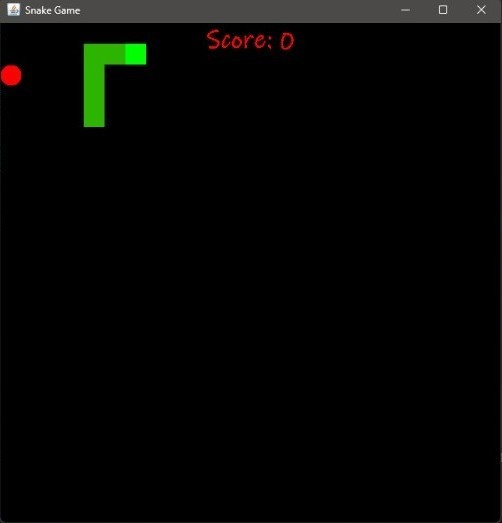

# SnakeGameJava

A classic Snake game built using Java Swing.

## How to Run

1. Clone the repository or download as ZIP.
2. Open the project in IntelliJ IDEA.
3. Run `SnakeGame.java`.

## Features

- Arrow key controls
- Eat apple to grow
- Game over on collision
